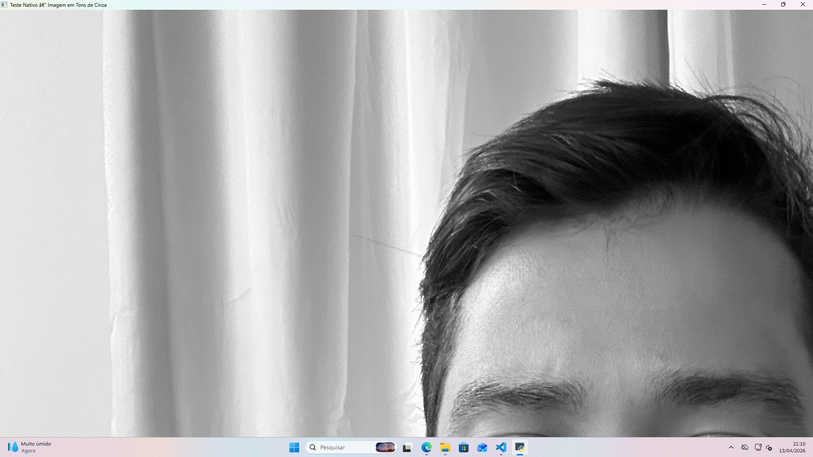

# Atividade Complementar: Configuração de Ambiente e Governança Git

**Disciplina:** Processamento Digital de Imagens — BCC / UNEMAT  
**Professor:** Prof. Dr. Carlos Alex Sander J. Gulo  
**Aluno:** Lucas Tiago Siqueira  
**Semestre:** 2026/1

---

## Objetivo

Configurar a estação de trabalho local para desenvolvimento em Visão Computacional,
adotando práticas de mercado para versionamento de código e gestão de dependências via GitHub.

---

## Ambiente de Desenvolvimento

| Especificação | Detalhe |
|---|---|
| **Sistema Operacional** | Microsoft Windows 11 Pro |
| **Processador** | AMD Ryzen 3 PRO 3200G with Radeon Vega Graphics |
| **RAM** | 8 GB |

---

## Missões de Governança

### Missão 1 — Ambiente Virtual e `.gitignore`

Ambiente virtual criado na pasta `venv/` dentro de `lista_2/`.
O arquivo `.gitignore` garante que o venv **não seja enviado** ao GitHub.

```bash
python -m venv venv
```

### Missão 2 — Congelamento de Dependências

Bibliotecas instaladas no ambiente virtual e dependências congeladas em `requirements.txt`:

```bash
pip install opencv-python numpy matplotlib
pip freeze > requirements.txt
```

Para restaurar o ambiente em qualquer máquina:

```bash
pip install -r requirements.txt
```

### Missão 3 — Documentação em Markdown

Este arquivo `README.md` documenta o ambiente, as missões e as instruções de execução do projeto.

### Missão 4 — Execução Nativa e Evidência Visual

Script `smoke_test.py` que abre uma janela nativa do OpenCV exibindo uma imagem autoral
convertida para tons de cinza.

```bash
python smoke_test.py
```


